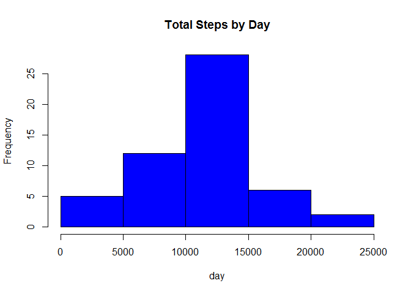
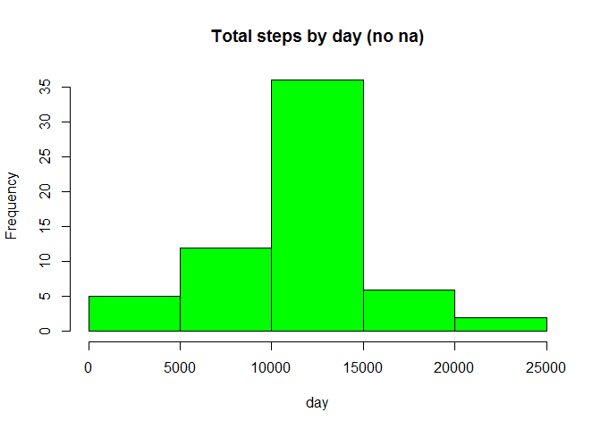
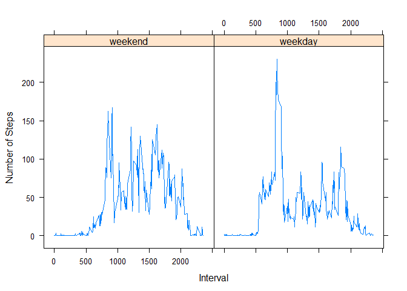

# Reproducible Research: Peer Assessment 1

```r
library(knitr)
```

```
## Warning: package 'knitr' was built under R version 3.2.3
```

```r
library(lattice)
opts_chunk$set(echo=TRUE,results='hold')
```

## Loading and preprocessing the data

```r
activityFile<-read.csv("activity.csv")
```

## What is mean total number of steps taken per day?
####find number of steps by date

```r
stepsbydate<-aggregate(activityFile$steps~activityFile$date,activityFile,FUN="sum")
colnames(stepsbydate)<-c("Date","Steps")
```

####Plot Histogram and calculate mean and median

```r
hist(stepsbydate$Steps,main="Total Steps by Day",xlab="day",col = "blue")
```



```r
meanSteps<-mean(stepsbydate$Steps,na.rm = TRUE)
medianSteps<-median(stepsbydate$Steps,na.rm=T)

meanSteps
medianSteps
```

```
## [1] 10766.19
## [1] 10765
```

## What is the average daily activity pattern?

####Steps by Interval

```r
stepsbyInterval<-aggregate(activityFile$steps~activityFile$interval,activityFile,FUN = "mean")
colnames(stepsbyInterval)<-c("Interval","Steps")
```

####plot line graph

```r
plot(stepsbyInterval$Interval,stepsbyInterval$Steps,type = "l",xlab = "Interval",ylab = "Number of Steps")
```


####Find max 5 interval for average steps taken

```r
maxInterval<-stepsbyInterval[stepsbyInterval$Steps==max(stepsbyInterval$Steps),]

maxInterval
```

```
##     Interval    Steps
## 104      835 206.1698
```

## Imputing missing values

####Number of Missing Cases and filling them with mean of steps for that interval

```r
NumberMissingCases<-sum(!complete.cases(activityFile))
activity2file<-activityFile

for (i in 1:nrow(activity2file)) {
        if(is.na(activity2file$steps[i])) {
                activity2file$steps[i]<-stepsbyInterval[which(activity2file$interval[i]==stepsbyInterval$Interval),]$Steps
        }
}
```


####Get Number of Steps by Date now with NAs filled and plot histogram

```r
stepsbyDateFillNA<-aggregate(activity2file$steps~activity2file$date,activity2file,FUN="sum")


hist(stepsbyDateFillNA$`activity2file$steps`,main = "Total steps by day (no na)",xlab="day",col = "green")
```




## Are there differences in activity patterns between weekdays and weekends?

####Covert date to posixlt. Create factor variables for weekday/weekend

```r
activity2file$date<-as.POSIXlt(activity2file$date)
activity2file$daytype<-factor(format(activity2file$date,"%A"))
levels(activity2file$daytype)
```

```
## [1] "Friday"    "Monday"    "Saturday"  "Sunday"    "Thursday"  "Tuesday"  
## [7] "Wednesday"
```

####Assign factor variable based on daytype

```r
levels(activity2file$daytype)<-list(weekend=c("Saturday","Sunday"),weekday=c("Monday","Tuesday","Wednesday","Thursday","Friday"))
stepsbyDay<-aggregate(activity2file$steps~activity2file$interval+activity2file$daytype,activity2file,FUN="mean")
colnames(stepsbyDay)<-c("Interval","Daytype","Steps")
```

####Plot the panel graph showing weekday and weekday partition

```r
par(mfrow=c(1,2))
xyplot(Steps~Interval | Daytype,stepsbyDay,type="l",layout(1,2),xlab="Interval",ylab = "Number of Steps")
```


